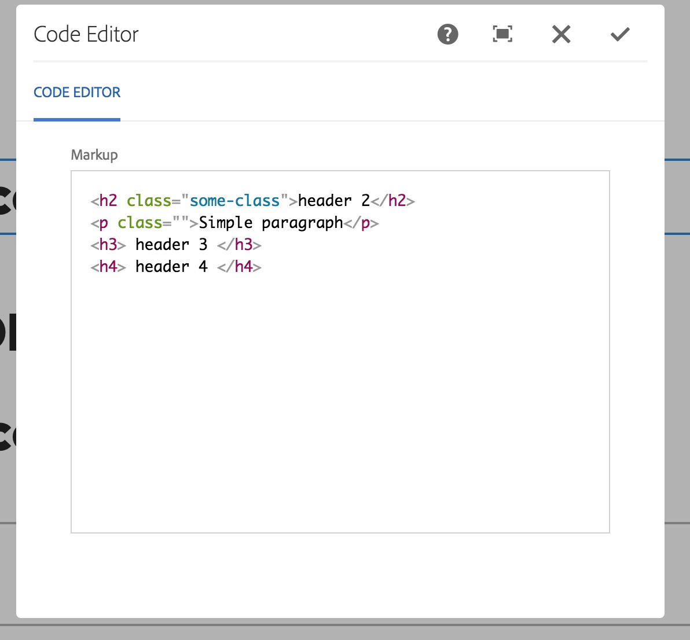

# AEM HTML Editor Widget

This a content package project generated using the AEM Multimodule Lazybones template.

## What is it?
It's a simple granite widget that will display HTML markup and highlight it using [CodeFlask](https://kazzkiq.github.io/CodeFlask.js/)

Sample dialog:


## Usage
> Tested and developed on AEM 6.3, though it "should" work on earlier AEM versions.

Build the project as described in the "Building" section. Then in any of your Touch UI dialogs add a field as follows:

>`rows` property: indicates the number of rows that should be visible in the code editor.

```
<title 
  jcr:primaryType="nt:unstructured"
  fieldLabel="Markup"
  name="./markup"
  rows="20"
  sling:resourceType="/apps/aem-html-editor-widget"/>
```

## Building

This project uses Maven for building. Common commands:

From the root directory, run ``mvn -PautoInstallPackage clean install`` to build the bundle and content package and install to a AEM instance.

## Using with AEM Developer Tools for Eclipse

To use this project with the AEM Developer Tools for Eclipse, import the generated Maven projects via the Import:Maven:Existing Maven Projects wizard. Then enable the Content Package facet on the _content_ project by right-clicking on the project, then select Configure, then Convert to Content Package... In the resulting dialog, select _src/main/content_ as the Content Sync Root.

## Using with VLT

To use vlt with this project, first build and install the package to your local CQ instance as described above. Then cd to `content/src/main/content/jcr_root` and run

    vlt --credentials admin:admin checkout -f ../META-INF/vault/filter.xml --force http://localhost:4502/crx

Once the working copy is created, you can use the normal ``vlt up`` and ``vlt ci`` commands.

## Specifying CRX Host/Port

The CRX host and port can be specified on the command line with:
mvn -Dcrx.host=otherhost -Dcrx.port=5502 <goals>


